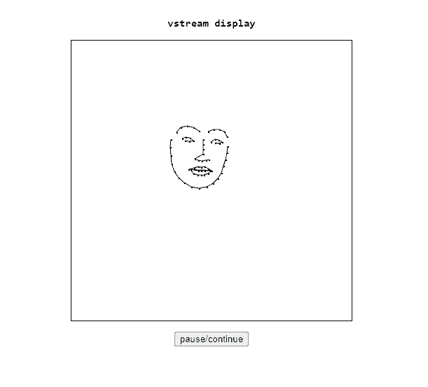

# vstream (WIP)
## face tracking for 3d models in the browser with Python, Flask and Socket.IO    
    
   
    
I'm currently using miniconda as my virtual environment on Windows 10.    
    
additional requirements (unfortunately not completely covered by requirements.txt - probably because I just pip installed these packages):    
- dlib
- flask
- flask-socketio
- cmake (needed for dlib)
- imutils
- You'll also need a dataset for predicting the facial landmarks. I used 'shape_predictor_68_face_landmarks.dat'
    
all this does right now is take coordinates for facial landmarks and draws dots based on those coordinates onto an HTML canvas. still working on the '3d models' part... Ideally I'm thinking this could be used as a layer in OBS and be useful for streaming with virtual avatars.    
	
## how-to    
- make sure you have a webcam set up and have a copy of `shape_predictor_68_face_landmarks.dat` in the same directory as `vstream.py`.
- run `python vstream.py` (takes a little while to start up)
- check out `http://127.0.0.1:5000`
- you should be able to see your face being tracked as a collection of dots in real-time in the browser!
	
## acknowledgements
- much thanks to Adrian Rosebrock and his tutorial: https://www.pyimagesearch.com/2017/04/17/real-time-facial-landmark-detection-opencv-python-dlib/    
- much thanks to Davis King for his work on dlib and the predictor dataset here: https://github.com/davisking/dlib-models