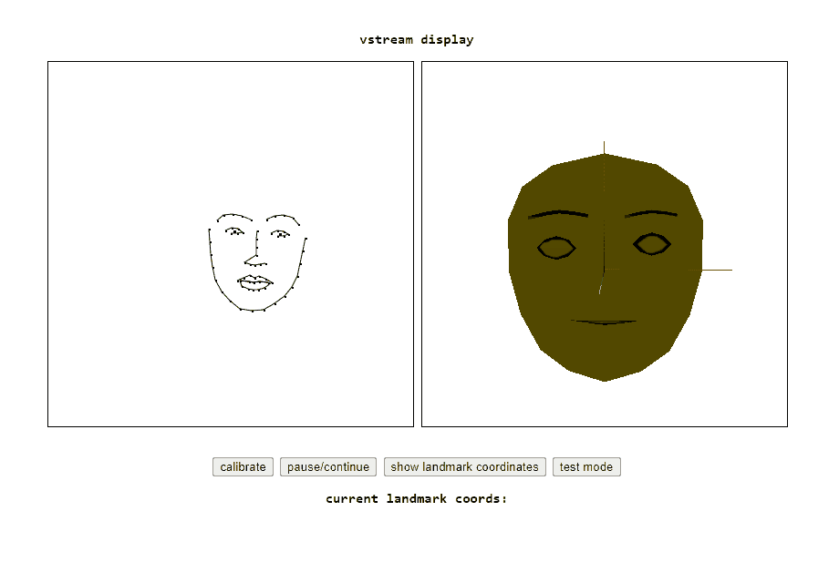

# vstream (kinda WIP, mostly experimental nonsense)
### face tracking for 3d models in the browser with Python, Flask and Socket.IO    
    
   
    
I'm currently using miniconda as my virtual environment on Windows 10. I used Blender for my example model avatar.    
    
additional requirements (need to pip install these manually):    
- dlib
- imutils
- You'll also need a dataset for predicting the facial landmarks. I'm using 'shape_predictor_68_face_landmarks.dat', which you can find downloadable on the Internet.
    
## background:    
Video streaming with avatars (i.e. vtubers) is a popular thing now at the time of this writing (9/2020) and I'm interested in how it works.    
Currently, my understanding is that most people use Live2D (so not really 3d models) to create the avatars and it's used with FaceRig to map real-time motions to the avatar. 
I also read that iPhones are commonly used for face/eye tracking. So there's definitely a lot of advanced (dare I say 'mystical') hardware and 
techniques going into just making a bunch of vertices move according to real-time movement but I wanted to have a go at trying to think of ways I could possibly arrive at the same result.
    
## current state:    
so right now I've got blinking, eyebrow movement and mouth movement going fairly well I think. :D but also there are some things to note:      
- I'm using shape keys to animate everything. this simplifies a ton of things (no need to worry about where an individual vertex should go)
but also maybe limits the range of possible expressions as well. because I'm using shape keys, I also split my avatar up into separate meshes to make it easier to keep track of things but it should be 
possible to just have one mesh I think and a bunch of shape keys. at this time, the .js code expects separate meshes though.
- getting the landmark coordinates to be stable, or rather trying to handle jittering (because that happens a LOT with just using OpenCV and dlib out of the box like I'm doing here) is incredibly frustrating.
- pupil tracking is also very hard and frustrating and I haven't been successful yet in getting satisfactory results. somehow what I have right now for pupil tracking seems to be a lot better than the blurring/find countours
 solution (but I should revisit it maybe) but it's still really finnicky. on top of that, finding the right threshold for the binary threshold is another pain point.
    
## things I'd like to do/have semi-done but maybe can be perfected?:
- eye/pupil tracking
- head rotation (something to do with mapping 2d coords to 3d?) 
- better/different avatars
    
One of the big questions I'm trying to solve is how can I best map landmark coordinate locations to the coordinates of a 3d model and have the model move in alignment with the user's face in real-time? Assuming I have all the landmark coordinates in the right places, how can I get my 3d model
to match the face generated by the landmark coords? Another question I'm interested in is the avatar - is there a way to have a purely 2d model? I think using a 3d model solves some potential issues with using a 2d avatar, i.e. if the head is rotated, how would I generate the appropriately-rotated face in 2d?    
	
## how-to    
- make sure you have a webcam set up and have a copy of `shape_predictor_68_face_landmarks.dat` in the same directory as `vstream.py`.
- run `python vstream.py` (takes a little while to start up)
- check out `http://127.0.0.1:5000`
- you should be able to see your face being tracked as a collection of dots in real-time in the browser, as well as an avatar in another canvas!
    
if using conda (make sure it's accessible from the command line), you can try this:    
- start up a new conda environment with `conda create --name vstream --file requirements.txt`, or do `conda env list` to see what envs currently exist. 
- if you want to use an already created environment, you can do `activate <env name>` (make sure you have/install the required libraries!). otherwise, `activate vstream`
- install `imutils` and `dlib` via `pip install` (not really sure why but conda seems to have trouble downloading these via requirements.txt)
- then `python vstream`
    
## files    
kind of a mess right now. in /templates, algorithm_testing.html can be run as a standalone file via python -m http.server, which just loads a set of landmark coordinates 
and lets you change individual coordinates' x and y values to see how they affect the avatar. in the root directory, basic_test.py serves a webpage that just shows real-time 
facial landmark coordinates on a canvas. I used this to test my backend code (mainly the pupil tracking idea I had since that involves messing with some of the landmark coordinates 
to produce new coordinates of the pupils' estimated locations). vstream.py is the actual 'product'.    
	
## acknowledgements
- much thanks to Adrian Rosebrock and his tutorial: https://www.pyimagesearch.com/2017/04/17/real-time-facial-landmark-detection-opencv-python-dlib/    
- much thanks to Davis King for his work on dlib and the predictor dataset here: https://github.com/davisking/dlib-models